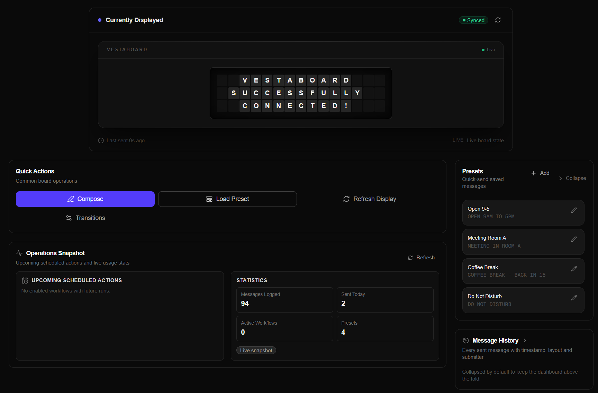
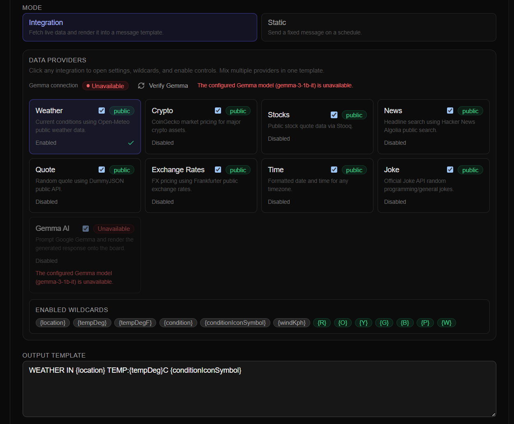
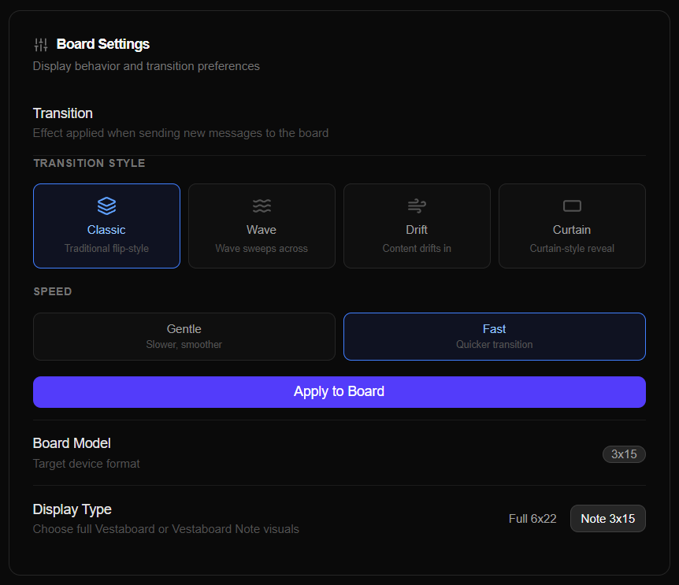
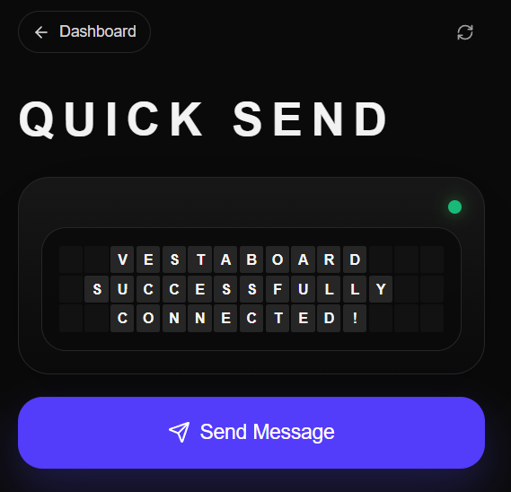

# Vestaboard WebUI

A self-hosted control panel for your Vestaboard. Compose messages, manage presets, build automated workflows with live data, and monitor your board — all from a clean web UI.

---

## Features

- **Live board preview** — see your current Vestaboard state directly in the browser
- **Message composer** — type text or enter raw character codes, with alignment controls and transition effects
- **Presets** — save and reuse your favourite messages with one click
- **Message history** — every sent message is logged; reload any past message into the composer
- **Workflow automation** — schedule recurring messages (daily, weekly, cron, or one-time) with optional live data from 9 built-in integrations
- **Mobile-friendly Quick Send** — minimal interface for sending from a phone
- **Gemma AI** — optionally generate board content using Google's Gemma model

---

## Screenshots

### Dashboard
View the current board state, fire off presets, and browse message history.



### Workflow Studio
Schedule automated messages with built-in data providers: weather, crypto, stocks, news, quotes, jokes, and more.



### Settings
Test your API connection, switch board models, and configure transition effects.



### Quick Send (Mobile)
A stripped-down send page built for phones — compose, preview, send.



---


---

## Tech Stack

| Layer | Library |
|---|---|
| Framework | Next.js 16 (App Router) + TypeScript |
| Styling | Tailwind CSS v4 |
| Animation | Framer Motion |
| Forms | React Hook Form + Zod |
| Icons | Lucide React |
| Auth | Iron Session (encrypted cookie, no database) |

---

## Quick Start

```bash
# 1. Copy the env template and fill in your values
cp .env.local.example .env.local

# 2. Install and run
npm install
npm run dev
```

Open [http://localhost:3000](http://localhost:3000) and log in with the `ACCESS_CODE` you set.

### Launch Scripts (build + start)

**macOS / Linux:**
```bash
chmod +x run.sh && ./run.sh
```

**Windows:**
```bat
.\runWebApp.bat
```

Both scripts install dependencies, build, run advisory startup tests, and start the production server.

---

## Environment Variables

Create `.env.local` from `.env.local.example` and populate all required values.

| Variable | Required | Description |
|---|---|---|
| `SESSION_SECRET` | **Yes** | 32+ character random string for cookie encryption |
| `ACCESS_CODE` | **Yes** | Passphrase for the login screen |
| `VESTABOARD_API_TOKEN` | **Yes** | Vestaboard RW (read/write) API key |
| `CRON_SECRET` | Optional | Bearer token to authenticate the workflow scheduler endpoint |
| `GEMMA_API_KEY` | Optional | Google AI Studio key for Gemma-powered workflow messages |

**Generating secrets:**
```bash
# SESSION_SECRET
node -e "console.log(require('crypto').randomBytes(32).toString('hex'))"

# CRON_SECRET
node -e "console.log(require('crypto').randomBytes(24).toString('base64url'))"
```

---

## Project Structure

```
app/
  (app)/               # Authenticated app shell
    page.tsx           # Dashboard — board preview, presets, history
    compose/page.tsx   # /compose — re-exports dashboard
    workflows/page.tsx # Workflow Studio
    settings/page.tsx  # Settings (connectivity, board model, transitions)
  login/               # Login page
  quick-send/          # Mobile-first send page
  api/
    auth/              # login / logout / session check
    vestaboard/        # current, send, preview, transition, connectivity
    workflows/         # CRUD + runner + preview
    messages/          # Message history

components/
  board/               # BoardGrid, BoardCell, animated display
  dashboard/           # Presets, history, quick actions
  forms/               # ComposeDrawer, PresetEditor
  navigation/          # Sidebar, header
  workflows/           # WorkflowRunnerHeartbeat (client polling)
  ui/                  # Primitive components (Button, Dialog, Toast, …)

lib/
  board-utils.ts       # Character encoding, matrix helpers, text wrapping
  board-model.ts       # Board profile definitions (flagship 6×22, note 3×15)
  vestaboard-server.ts # Server-side Vestaboard API proxy + retry logic
  message-validation.ts # Text and matrix validation
  message-history.ts   # JSON-backed message log (write-locked)
  preset-store.ts      # JSON-backed preset store (write-locked)
  workflow-store.ts    # JSON-backed workflow store (write-locked CRUD + runner)
  workflow-scheduler.ts # Next-run-at calculation for all schedule types
  workflow-integrations.ts # Data provider resolvers
  gemma-server.ts      # Google Gemma API client
  server-auth.ts       # requireSession() / getSession() helpers
  api-client.ts        # Type-safe browser-side API wrapper

config/
  constants.ts         # Board dimensions, colour map, route constants
  session.ts           # Iron-session cookie config

types/index.ts         # All TypeScript DTOs and domain interfaces

data/                  # Runtime JSON persistence — gitignored, auto-created
scripts/
  startup-tests.mjs    # Env var + API connectivity checks
```

---

## Workflow Automation

Workflows let you send scheduled messages to your board, optionally pulling live data from external services.

### Schedule Types

| Type | Description |
|---|---|
| `once` | Sends at a specific date and time |
| `daily` | Sends every day at a chosen time |
| `weekly` | Sends on selected days of the week |
| `cron` | Full cron expression (minute + hour fields) |

### Data Integrations

| Provider | What it sends | API |
|---|---|---|
| Weather | Temperature, conditions, wind | Open-Meteo (free) |
| Crypto | Price, 24h change | CoinGecko (free) |
| Stocks | OHLCV quote | Stooq (free) |
| News | Top Hacker News headline | HN Algolia (free) |
| Quote | Random inspirational quote | DummyJSON (free) |
| Exchange Rates | Currency conversion rate | Frankfurter (free) |
| Time | Current time/date/timezone | Server clock |
| Joke | Setup + punchline | Official Joke API (free) |
| Gemma AI | AI-generated board copy | Google Gemma (`GEMMA_API_KEY`) |

Use `{variableName}` placeholders in your message template — they're filled in at send time.

### Vercel Cron (automated scheduling)

`vercel.json` fires the workflow runner every 5 minutes on Vercel:

```json
{
  "crons": [{ "path": "/api/workflows/runner", "schedule": "*/5 * * * *" }]
}
```

Set `CRON_SECRET` in your Vercel environment variables for authenticated cron requests.

---

## Vestaboard API Routes

| Method | Path | Description |
|---|---|---|
| `GET` | `/api/vestaboard/current` | Fetch live board state (falls back to mock) |
| `POST` | `/api/vestaboard/send` | Send text or raw matrix to the board |
| `POST` | `/api/vestaboard/preview` | Render a text preview without sending |
| `GET` | `/api/vestaboard/transition` | Get current transition setting |
| `PUT` | `/api/vestaboard/transition` | Update transition setting |
| `GET` | `/api/vestaboard/connectivity` | Check API token connectivity |

The `VESTABOARD_API_TOKEN` is never sent to the browser. All board operations are proxied server-side.

---

## Security Notes

- Login uses a constant-time string comparison that pads both inputs to the same length before XOR-comparing every character, preventing timing attacks and length oracle leaks
- A 400 ms artificial delay is applied on every failed login attempt to slow brute-force attacks
- Session cookies are `httpOnly`, `sameSite: lax`, and expire after 24 hours
- The `secure` cookie flag is **off by default** so the launchers work over plain HTTP; set `SECURE_COOKIES=true` when serving over HTTPS
- All protected API routes call `requireSession()` before doing any work
- The workflow runner endpoint requires either a valid session cookie or the `CRON_SECRET` header — if `CRON_SECRET` is not configured, only session auth is accepted
- The Vestaboard API token is never sent to the browser; all board operations are proxied server-side
- Never commit `.env.local` or any file containing real credentials

---

## Developer Docs

Full documentation lives in [`docs/`](docs/):

- [Architecture](docs/architecture.md) — request flow, auth, persistence, component structure
- [Workflows](docs/workflows.md) — scheduling, data providers, execution pipeline
- [Character Encoding](docs/character-encoding.md) — Vestaboard codes, colour tiles, matrix format
- [Deployment](docs/deployment.md) — Vercel, Docker, environment setup
- [Adding Integrations](docs/adding-integrations.md) — extend workflows with a new data provider
